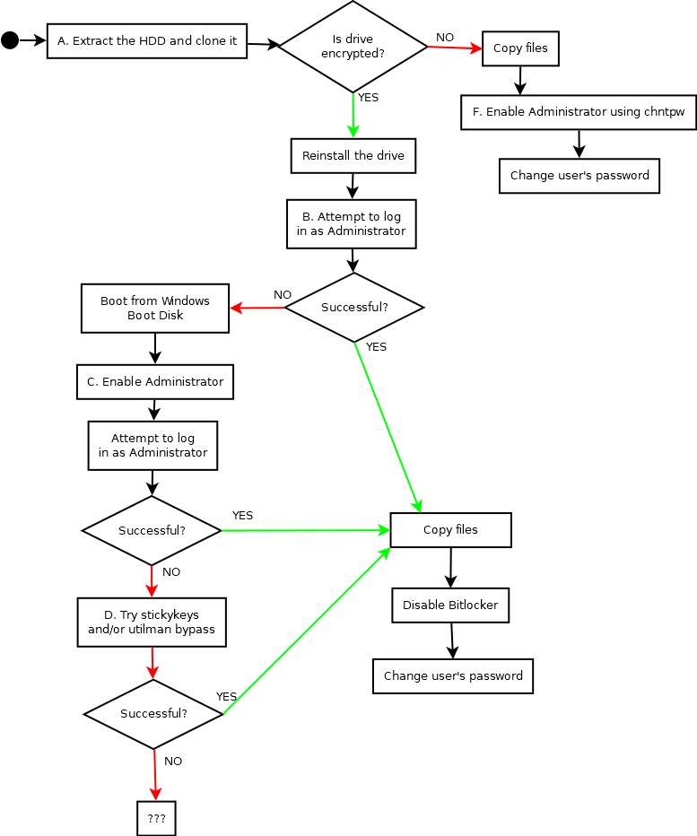

# Locked out of Windows Workstation

Typical scenario: A user cannot remember the password for their system (or the user cannot be reached) and you need access to data stored on the system and, ideally, the ability to log in to the system as the user. The account is a local account, or account recovery via Microsoft is not an option. The credentials for the Administrator account are not known.

# Process Diagram



# Goals

1. Copy Files
2. Get into the account without losing files.

# Process Descriptions

## A. Extract the HDD and clone it using clonezilla or Kali Linux in Forensic Mode (or boot device with Kali if Secure Boot is disabled)

Kali Linux:

```
mkdir /mnt/forensic
mkdir /mnt/clone
mount -o ro /dev/sd? /mnt/forensic
mount /dev/sd? /mnt/clone
cp -a /mnt/forensic /mnt/clone
```

## B. Attempt to log in as Administrator

Boot into Windows. At the login screen, select "Other" and enter "Administrator", without any password.

## C. Enable Administrator

Enable the Administrator account

```
net user administrator /active:yes
```

Optional (sets admin password, otherwise there's no password):
```
net user administrator *
```

CAUTION: POTENTIAL FILE DELETION. You can change the user's password here too.
```
net user <username> *
```

Log in as Administrator or user


## D. Try stickykeys and/or utilman bypass

Boot with Windows installation/recovery disk, Open command prompt

Overwrite sethc.exe (stickykeys)

```
copy c:\Windows\system32\sethc.exe c:\sethc.exe
copy c:\Windows\system32\cmd.exe c:\Windows\system32\sethc.exe
```

Overwrite utilman

```
copy c:\Windows\system32\utilman.exe c:\utilman.exe
copy c:\Windows\system32\cmd.exe c:\Windows\system32\utilman.exe
```

Restart. At login screen, hit shift 5 times to activate the stickykeys bypass.
or, click the "Ease of Access" icon to activate the utilman bypass.

A terminal should pop up, running as SYSTEM

NOTE: If this is your first opportunity to copy files, USB, FTP, CURL work here. Be aware that the command prompt may automatically close after some delay (~5 minutes?).  (To list USB drives: wmic logicaldisk get deviceid,volumename,description)


## E. Password recovery (if you really need to figure out the password that was used)

Copy the following paths:

```
C:\Windows\System32\config\SAM
C:\Windows\System32\config\SYSTEM
```

Build a password database using HackBrowserData, which searches through browser vaults for passwords. Examples of where it searches are:

```
C:\Users\*\AppData\Chrome\
C:\Users\*\AppData\Local\Mozilla\
```

Use a password list from SecLists (`Passwords/Common-Credentials/10-million-password-list-top-100000.txt` is a decent starting point).
Supplement with any creds found with HackBrowserData, or your own OSINT.

Use the password database and John to break the SAM database: (Note: samdump2 may not work correctly w/ recent Windows 10 or Windows 11 SAM files)

```
samdump2 -o sam.txt C:\Windows\System32\config\SYSTEM C:\Windows\System32\config\SAM
john --wordlist=dictionary.txt --format=LM sam.txt
```

Tools:
* https://github.com/danielmiessler/SecLists/tree/master/Passwords
* https://github.com/moonD4rk/HackBrowserData
* https://github.com/ohyicong/decrypt-chrome-passwords
* https://www.dumpzilla.org/
* https://www.openwall.com/john/
* https://github.com/azan121468/SAMdump2

## F. Enable Administrator using chntpw (Kali)

(Only works with Administrator and local users)

1. Ensure that you've make a clone of the hard drive and that the clone works.

2. Mount the Windows drive in Kali and navigate to the SAM file
```
mount /dev/sd? /mnt/win
cd /mnt/win/Windows/System32/config
```

3. Use chntpw to list all users and unlock the Administrator account

```
chntpw -l SAM 
chntpw -u Administrator SAM
(Select: Unlock the account)
```

4. (Optional) Clear a password from a user.

```
chntpw -u <username or RID> SAM
(Select: Clear the password)
```

Boot into Windows and you can now sign it as both the user and Administrator with no password.

